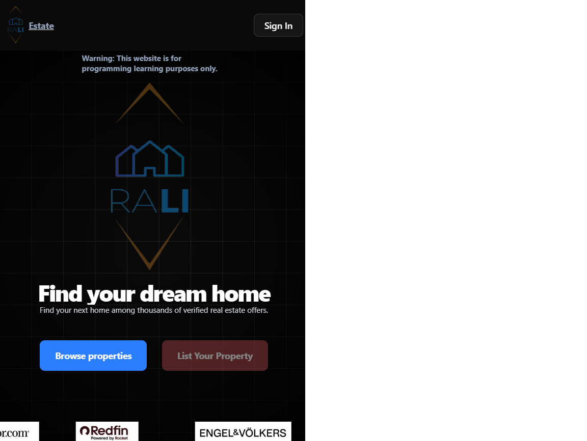
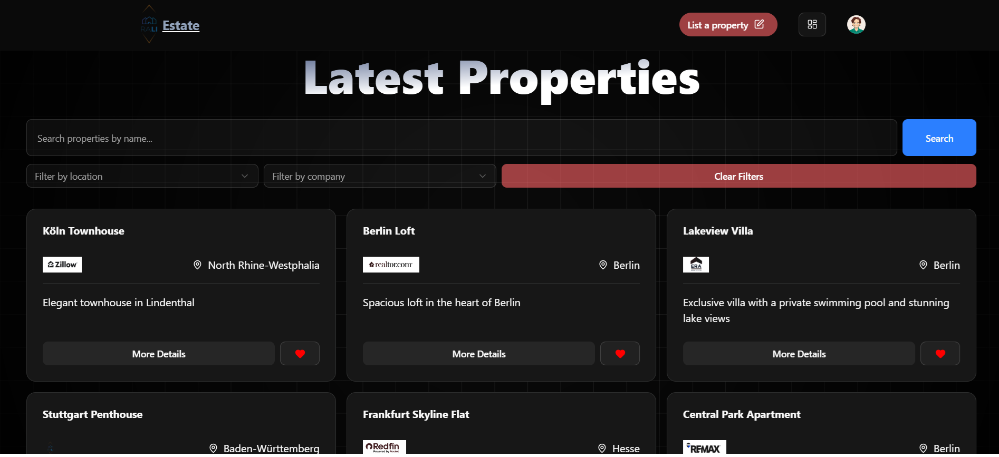
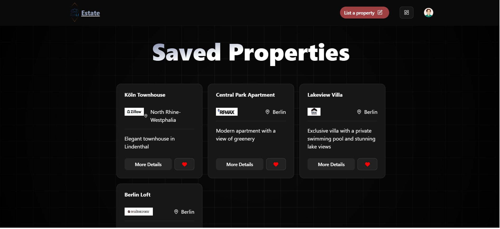
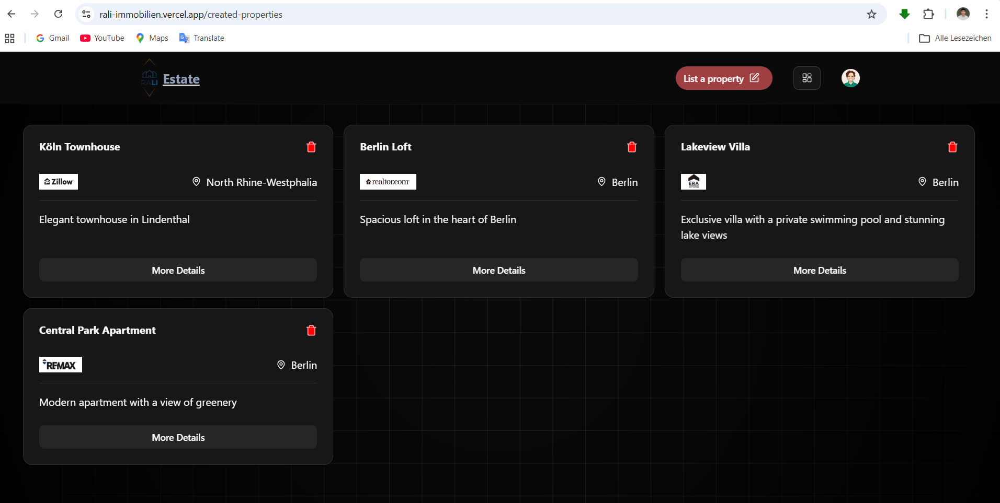
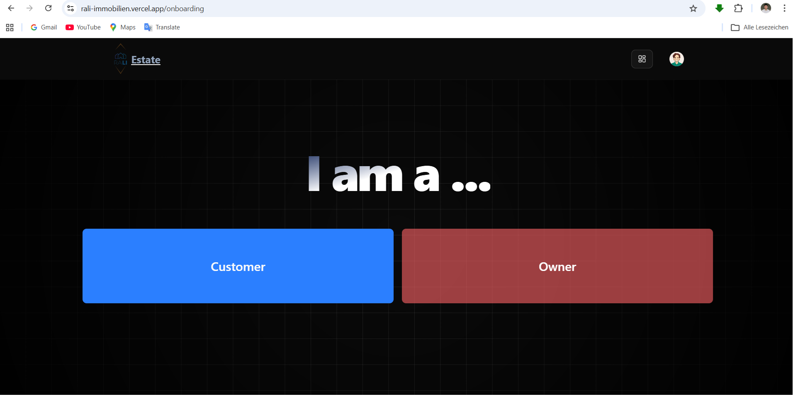

# Immobilien Web App

**Live-Demo:** [rali-immobilien.vercel.app](https://rali-immobilien.vercel.app)

Dies ist ein einfaches Immobilien-Projekt, das mit React, Vite, Supabase, Clerk, Tailwind CSS und shadcn/ui umgesetzt wurde. Die Anwendung simuliert eine moderne Immobilienplattform mit Features wie Immobilienübersicht, Favoriten, Eigentümerbereich, Bilder-Upload und mehr – komplett ohne eigenes Backend, sondern mit Supabase als Datenbank und Storage.

## Projektbeschreibung

Das Projekt bietet folgende Funktionen:

- **Immobilienübersicht:** Durchsuchen und filtern Sie Immobilien nach Name, Standort und Anbieter.
- **Favoriten:** Speichern Sie interessante Immobilien in Ihrer Favoritenliste.
- **Eigentümerbereich:** Immobilienbesitzer können eigene Immobilien anlegen, verwalten und löschen.
- **Bilder-Upload:** Zu jeder Immobilie können bis zu 5 Bilder hochgeladen werden.
- **Unternehmensverwaltung:** Neue Immobilienfirmen können hinzugefügt werden.
- **Onboarding:** Neue Nutzer wählen beim ersten Login ihre Rolle (Kunde oder Eigentümer).
- **Authentifizierung:** Anmeldung und Nutzerverwaltung über Clerk.
- **Supabase Storage:** Bilder werden sicher im Supabase Storage gespeichert.
- **Tailwind CSS & shadcn/ui:** Modernes, responsives UI-Design mit Tailwind CSS und Komponenten von shadcn/ui.
- **Responsive Design:** Optimiert für Desktop und mobile Geräte.

## Screenshots

landing(`Landingpage.jsx`):

properties(`Listingproperty.jsx`):

saved-properties(`Savedproperties.jsx`):

created-properties(`Createdproperties.jsx`):

upload-images(`UploadImages.jsx`):

onboarding(`Onboarding.jsx`):

## Anwendung steuern

- **Immobilien suchen:** Nutzen Sie die Such- und Filterfunktionen auf der Immobilienübersicht.
- **Favoriten:** Klicken Sie auf das Herzsymbol, um Immobilien zu speichern.
- **Eigentümerbereich:** Über das Dashboard gelangen Sie zu Ihren eigenen Immobilien.
- **Immobilie anlegen:** Über „List Your Property“ können Eigentümer neue Immobilien einstellen.
- **Bilder hochladen:** Nach dem Anlegen einer Immobilie können Bilder hinzugefügt werden.
- **Unternehmen hinzufügen:** Im Formular zur Immobilienerstellung können neue Firmen angelegt werden.
- **Rolle wählen:** Beim ersten Login wählen Sie, ob Sie Kunde oder Eigentümer sind.

## Projekt von GitHub clonen und starten

1. **Repository clonen**
   - bash
   - git clone https://github.com/rali-dev/mern-immobilien.git
  
2. **Projekt starten**
   - Wechsle in das `client`-Verzeichnis:
     - cd client
   - Installiere die Abhängigkeiten:
     - npm install
   - Starte die Anwendung:
     - npm run dev
   - Öffne die angezeigte lokale URL im Browser.

## Voraussetzungen
- Node.js und npm installiert
- Ein moderner Webbrowser (Chrome, Firefox, Edge, Safari)
- Optional: Ein Editor wie Visual Studio Code für Anpassungen

**Viel Spaß beim Ausprobieren!**
